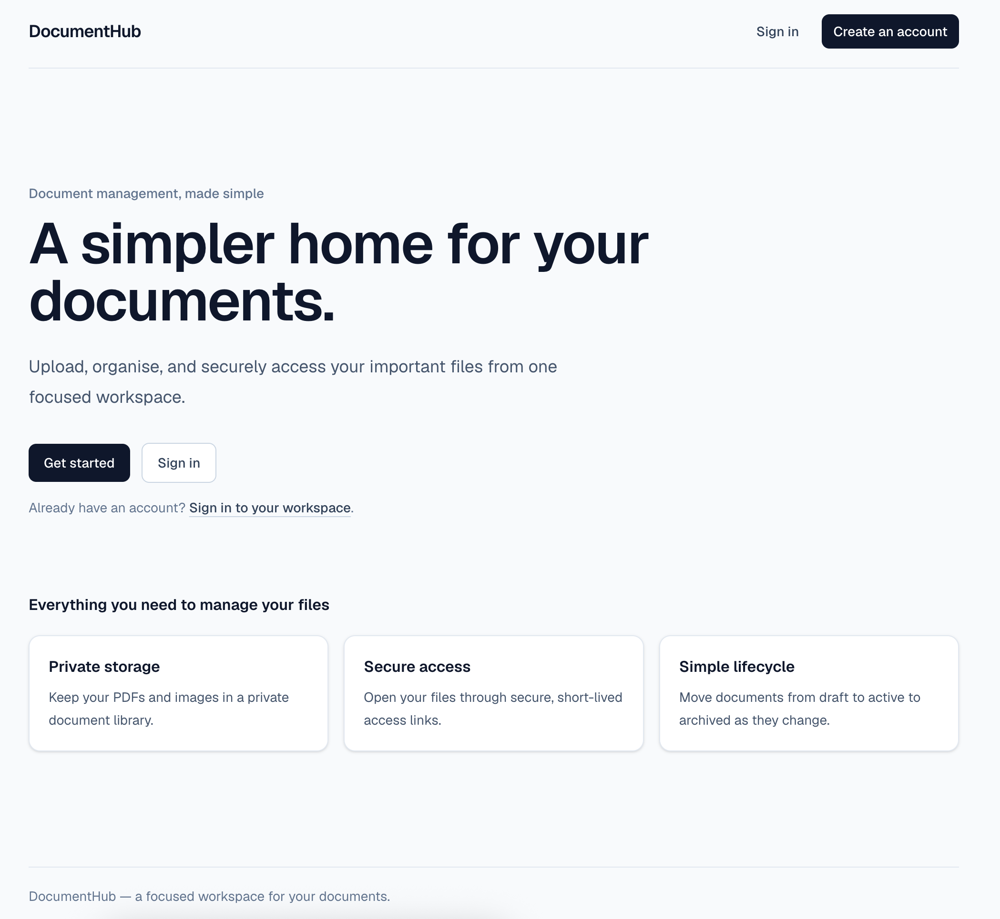
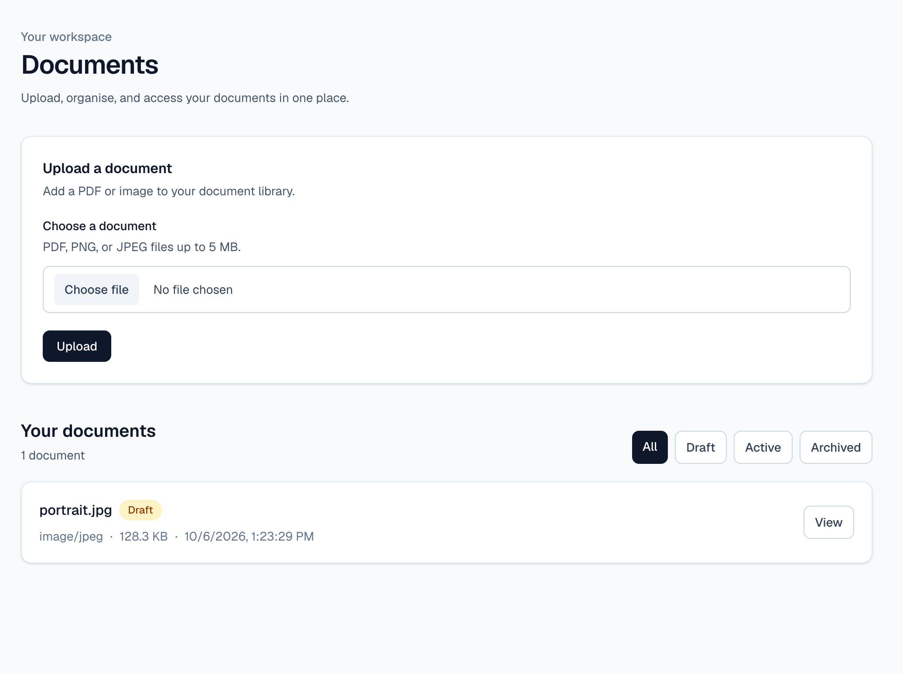
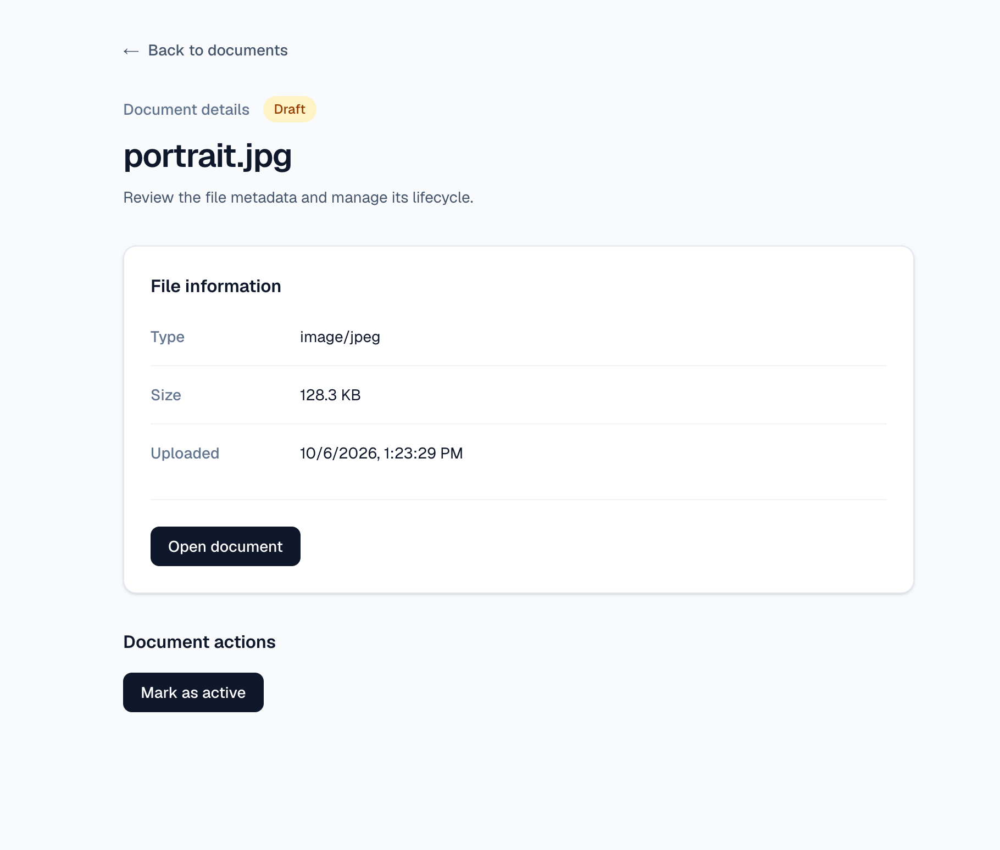

# DocumentHub

DocumentHub is a small document-management application for uploading, organising,
and securely accessing personal documents.

**Try the live application:** [document-hub-two.vercel.app](https://document-hub-two.vercel.app/)

It is built as a portfolio project, but the deployed application is ready to use.

## What you can do

- Create an account and sign in securely.
- Upload PDF, PNG, and JPEG files up to 5 MB.
- Keep uploaded files private to your account.
- View document metadata and open files through short-lived secure links.
- Manage documents through a simple `draft` → `active` → `archived` lifecycle.
- Filter documents by lifecycle status.
- Restore archived documents or permanently delete them when they are no longer needed.

DocumentHub uses database and Storage-level ownership rules so users can only access
their own documents.

## See it in action

The current interface is intentionally focused on the core document workflow:



_Public landing page with clear paths to sign in or create an account._



_Authenticated workspace for uploading, filtering, and viewing documents._



_Document details with secure file access and lifecycle actions._

## Getting started

### Use the live application

1. Open the [DocumentHub live application](https://document-hub-two.vercel.app/).
2. Select **Create an account** and register with an email address and password.
3. Check your email and follow the confirmation link if prompted.
4. Sign in and open the documents workspace.
5. Upload a PDF or image, then try viewing it and changing its lifecycle status.

No installation is required to try the deployed application.

## Tech stack

| Technology | Purpose |
| --- | --- |
| Next.js with App Router | Application pages, layouts, Server Components, Server Actions, and Route Handlers |
| React and TypeScript | UI and type-safe application code |
| Tailwind CSS | Responsive styling |
| Supabase Auth | Email/password authentication and sessions |
| Supabase PostgreSQL | Document metadata and lifecycle state |
| Supabase Storage | Private file storage |
| Row Level Security | Database and file ownership enforcement |
| Vercel | Production hosting and deployment |

## For developers

The repository is public, so you can inspect the implementation or run your own
development copy.

### Prerequisites

- A supported Node.js LTS release
- [pnpm](https://pnpm.io/)
- A Supabase project for local development

### Run locally

```bash
git clone https://github.com/willytjandra/document-hub.git
cd document-hub
pnpm install
cp .env.example .env.local
```

Update `.env.local` with the URL and publishable key from your Supabase development
or staging project:

```dotenv
NEXT_PUBLIC_SUPABASE_URL=https://your-project-ref.supabase.co
NEXT_PUBLIC_SUPABASE_PUBLISHABLE_KEY=your-publishable-key
```

Then start the development server:

```bash
pnpm dev
```

Open [http://localhost:3000](http://localhost:3000). Local development should use a
non-production Supabase project. Database setup and migration procedures are covered
in the [database operations runbook](RUNBOOK.md).

### Validate changes

Run the production validation command before opening a pull request or pushing to
`main`:

```bash
pnpm build:prod
```

This runs linting, Next.js type generation, TypeScript checking, and the production
build.

## Documentation

### Learning journey

The project was built in six practical slices. These guides explain the decisions,
implementation steps, and lessons from each milestone:

1. [Foundation](docs/learning/01-foundation.md)
2. [Supabase Auth](docs/learning/02-supabase-auth.md)
3. [Document Upload](docs/learning/03-document-upload.md)
4. [Document Metadata](docs/learning/04-document-metadata.md)
5. [Document Lifecycle](docs/learning/05-document-lifecycle.md)
6. [Vercel Deployment](docs/learning/06-vercel-deployment.md)

For the current system design and operational procedures, see:

- [Architecture overview](docs/architecture.md)
- [Database operations runbook](RUNBOOK.md)

## Feedback and issues

Found a bug or have an idea for improving DocumentHub? Please [open an issue on
GitHub](https://github.com/willytjandra/document-hub/issues) with enough detail to
reproduce the problem.

Please do not include passwords, Supabase keys, private documents, or other sensitive
information in an issue.
